# Dummy Bank Portal — Fraud Detection & RPA Intake System (Version 2.0)

An enterprise-grade, high-performance **Bank Fraud Case Management & Investigation System** designed to bridge automated Robotic Process Automation (**AutomationEdge Process Studio**) intake pipelines with a transactional **PostgreSQL 16** backend and a responsive operations dashboard.

> 📖 **Full Technical Release Report:** See [`PROJECT_REPORT_V2.md`](./PROJECT_REPORT_V2.md) for full architectural specifications, PostgreSQL FTS, DB triggers, table partitioning, and benchmark results.

---

## 1. System Architecture

```mermaid
flowchart TD
    subgraph INTAKE["Fraud Intake Channels"]
        A1["Customer Mobile App / Net Banking"]
        A2["Fake QR Standee / Phishing Scams"]
        A3["Branch Helpdesk / Call Center"]
    end

    subgraph RPA["AutomationEdge Process Studio (RPA)"]
        B1["Intake Workflow / Data Grid"]
        B2["Payload Extraction & JavaScript Formatter"]
        B3["Advanced REST Client (POST /api/fraud-tickets)"]
    end

    subgraph BACKEND["Production ASGI Server (FastAPI + Uvicorn)"]
        C1["Request Tracing (X-Request-ID) & Latency Middleware"]
        C2["Pydantic Data Validation & OpenAPI Generator"]
        C3["Thread-Safe PostgreSQL Warm Connection Pool (DBUtils)"]
        C4["API Endpoints & Interactive Docs (/docs, /redoc)"]
    end

    subgraph DB["PostgreSQL 16 Database (bank_fraud_portal)"]
        D1[("customers Master")]
        D2[("customer_accounts")]
        D3[("fraud_tickets")]
        D4[("transactions Ledger")]
        D5[("audit_logs Immutable Trail")]
    end

    subgraph CLIENTS["Investigation & Operations"]
        E1["Operations Portal UI (http://localhost:5050)"]
        E2["Swagger UI Interactive Docs (http://localhost:5050/docs)"]
        E3["pgAdmin 4 Database Client (Port 5432)"]
    end

    INTAKE --> RPA
    RPA -->|HTTP POST JSON Payload| BACKEND
    BACKEND --> DB
    DB --> CLIENTS
```



---

## 2. Production Features

- **Production ASGI Engine**: Powered by **FastAPI + Uvicorn** delivering high-concurrency asynchronous I/O and low latency.
- **Interactive Swagger Documentation**: Built-in Swagger UI at **`/docs`** and ReDoc at **`/redoc`** for instant RPA payload inspection and testing.
- **Pydantic Validation**: Strict and resilient schema validation for incoming incident reports with automatic error formatting.
- **Connection Pooling**: Pre-warmed **DBUtils.PooledDB** managing PostgreSQL sockets with sub-millisecond query latency and automatic reconnection retries.
- **Distributed Request Tracing**: Every HTTP request receives and propagates an immutable `X-Request-ID` UUID for end-to-end audit tracing.
- **Observability & Metrics**: Dedicated `/api/metrics` and `/health` endpoints providing uptime, request volume, error rates, and pool latency.
- **Automated RPA Ingestion**: Built-in JSON normalizer accepting incoming complaint dispatches from AutomationEdge Process Studio workflows.
- **Corporate Dashboard**: High-contrast Corporate White & Deep Blue interface with live search, status filters, one-click account freezing, dossier slide-over drawer, and CSV reporting export.

---

## 3. Technology Stack

- **Backend**: Python 3.10+, FastAPI, Uvicorn ASGI Server, Pydantic
- **Database**: PostgreSQL 16 (`bank_fraud_portal`), `pg8000` driver, `DBUtils` connection pooling
- **Frontend**: Vanilla HTML5, CSS3 Custom Properties Design System, Modern JavaScript (ES6+)
- **RPA Integration**: AutomationEdge Process Studio (Modified Java Script Value + Advanced REST Client)

---

## 4. Quick Start Guide

### Prerequisites
- Python 3.10 or higher
- PostgreSQL 14+ running on port 5432
- Git

### Installation

1. **Clone the Repository**:
   ```bash
   git clone https://github.com/abhishekmalwadkar-png/FraudDetection_V1.git
   cd FraudDetection_V1
   ```

2. **Configure Environment Variables**:
   Copy `.env.example` to `.env` and fill in your PostgreSQL credentials:
   ```bash
   cp .env.example .env
   ```

3. **Install Dependencies**:
   ```bash
   pip install -r requirements.txt
   ```

4. **Initialize Database Schema & Sample Data**:
   ```bash
   python db_setup.py
   ```

5. **Start Production Server**:
   - On Windows: Run `start_production.bat` or:
   ```bash
   python server.py
   ```
   - Access the Web Portal: `http://127.0.0.1:5050`
   - Access **Interactive Swagger UI**: `http://127.0.0.1:5050/docs`
   - Access **ReDoc**: `http://127.0.0.1:5050/redoc`
   - Access Health Check: `http://127.0.0.1:5050/health`
   - Access System Metrics: `http://127.0.0.1:5050/api/metrics`

---

## 5. API Reference

| Endpoint | Method | Description |
| :--- | :---: | :--- |
| `/docs` | `GET` | Interactive Swagger UI documentation and API client |
| `/redoc` | `GET` | ReDoc API documentation |
| `/health` | `GET` | System health check and database ping latency |
| `/api/metrics` | `GET` | Observability metrics (requests, errors, uptime) |
| `/api/overview` | `GET` | Dashboard KPI summary statistics |
| `/api/fraud-tickets` | `GET` | List all fraud tickets with customer and account info |
| `/api/fraud-tickets` | `POST` | Ingest new fraud ticket from Process Studio RPA |
| `/api/fraud-tickets/{id}` | `GET` | Fetch single ticket dossier with linked transactions and audit trail |
| `/api/fraud-tickets/{id}` | `PATCH`| Update ticket status (`UNDER_INVESTIGATION`, `FROZEN`, `RESOLVED`) |
| `/api/freeze-account` | `POST` | Emergency customer account freeze |
| `/api/customers` | `GET` | Customer master directory with risk tiers |
| `/api/transactions` | `GET` | Transaction ledger with fraud risk scores |
| `/api/audit-logs` | `GET` | Immutable security and staff activity logs |
| `/api/db-status` | `GET` | PostgreSQL schema and table counts for pgAdmin sync |
| `/api/execute-sql` | `POST` | SQL execution console for database administration |

---

## 6. Process Studio RPA Ingestion Payload

To dispatch fraud complaints from Process Studio, format the request body using JavaScript:

```javascript
var request_body = JSON.stringify({
    "full_name": full_name,
    "email": email,
    "phone": String(phone),
    "account_number": String(account_number),
    "account_type": account_type,
    "incident_type": incident_type,
    "amount_involved": Number(amount_involved),
    "severity": severity,
    "suspect_entity": suspect_entity,
    "description": description
});
```
Send an HTTP POST request to: `http://127.0.0.1:5050/api/fraud-tickets` with `Content-Type: application/json`.
Expected response: `201 Created`.

---

## 7. Performance & Concurrency Testing

Run the multi-threaded concurrency validation test:

```bash
python test_concurrency.py
```

---

## 8. License

Internal Banking Operations — Dummy Bank Portal © 2026. All Rights Reserved.
